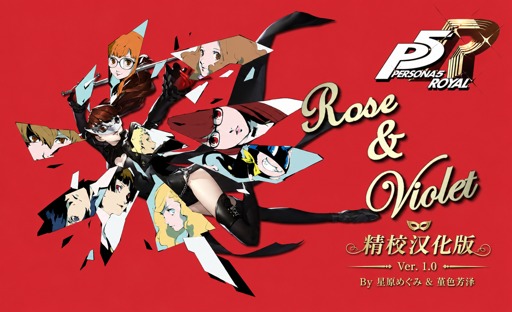

# P5R Rose & Violet 简体中文汉化补丁



《女神异闻录5 皇家版》Rose & Violet Mod 的简体中文人工精校汉化补丁。

本补丁依据 Mod 英文文本与实际剧情语境逐句校对，修正了人物称呼、说话人、短信、NPC 名称、人格面具名称及界面文本等内容，并集成芳泽霞中文姓名显示。项目已获得 Rose & Violet 原作者 Zylvos 授权。

## 版本信息

- 版本：1.0.0
- 作者：星原めぐみ & 堇色芳泽
- 适用游戏：《女神异闻录5 皇家版》
- 前置 Mod：Rose & Violet

## 安装教程

1. 下载 Release 中的 `P5R-Rose-and-Violet-ZH-Hans-v1.0.0.zip`。
2. 解压压缩包，得到 `p5rpc.kasumi.roseandviolet.zh-hans` 文件夹。
3. 将该文件夹放入 Reloaded-II 的 `Mods` 文件夹：

   ```text
   Reloaded-II\Mods\p5rpc.kasumi.roseandviolet.zh-hans
   ```

4. 在 Reloaded-II 中启用 Rose & Violet 原 Mod 和本汉化补丁。
5. 将本汉化补丁放在所有相关 Mod 的最后读取，确保其覆盖文件最后加载。
6. 更新旧版本后如遇文本未变化，请清理 P5R Mod Loader 缓存并完全重启游戏。

## 注意事项

- 本补丁不能脱离 Rose & Violet 原 Mod 单独运行。
- 请停用独立的 `Force (Custom) Protagonist Name` Mod。本补丁已经集成芳泽霞中文姓名显示，同时启用会产生冲突。
- 如使用其他会修改相同文本、角色或表格文件的 Mod，请始终让本汉化补丁最后读取。

## English

Manually proofread Simplified Chinese localization patch for the Persona 5 Royal Rose & Violet mod. Install the extracted folder into `Reloaded-II\Mods`, enable it together with the original Rose & Violet mod, and place this localization patch last in the mod load order.

Version 1.0.0 by 星原めぐみ & 堇色芳泽. Published with permission from the original Rose & Violet author, Zylvos.
